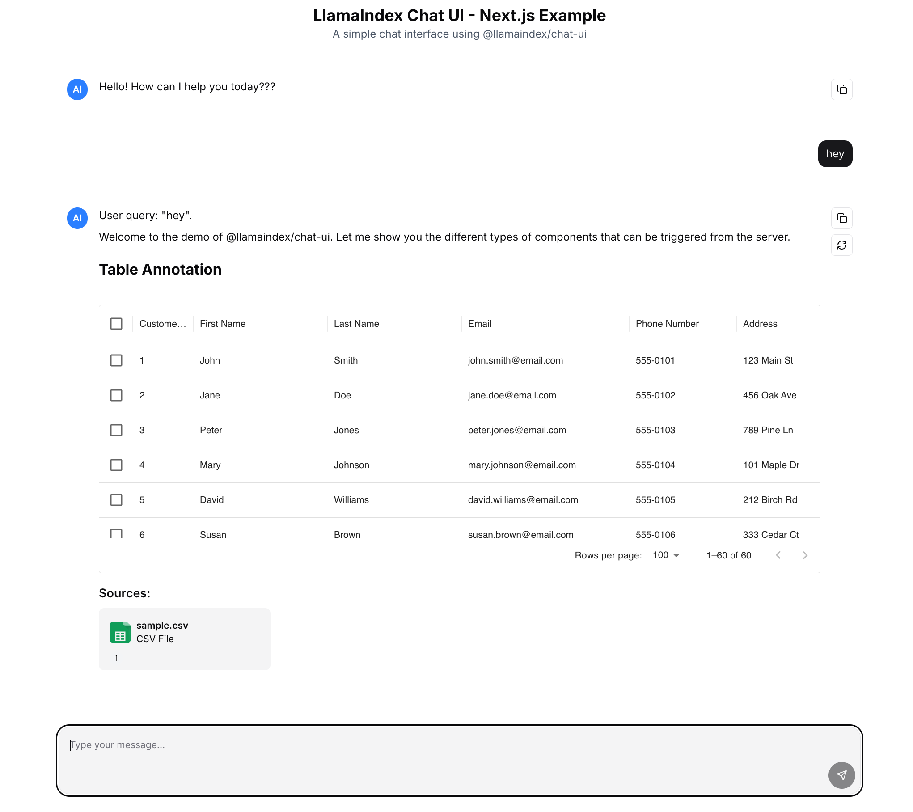

# Chat UI with Table Data Example

This is a simple `@llamaindex/chat-ui` library example with table data.
Copied from [@llamaindex/chat-ui Next.js Example](https://github.com/run-llama/chat-ui/tree/main/examples/nextjs) and custom annotation and widget using [MUI X DataGrid](https://mui.com/x/react-data-grid/) has added.

## Features

- Basic chat interface using `@llamaindex/chat-ui` components
- API route that integrates with LlamaIndex and OpenAI
- Fallback to fake streaming when API key is not available
- TypeScript support
- **Renders table data in chat**

## Getting Started

1. Install dependencies:

   ```bash
   npm install
   ```

2. Start the development server:

   ```bash
   npm run dev
   ```

3. Open [http://localhost:3000](http://localhost:3000) in your browser.

4. Chat and get table data.


## Project Structure

- `app/page.tsx` - Main chat interface
- `app/layout.tsx` - Root layout
- `app/api/chat/route.ts` - Chat API endpoint using LlamaIndex
- `app/rsc/` - React Server Components example with server actions
- `package.json` - Dependencies and scripts
- `next.config.js` - Next.js configuration
- `tsconfig.json` - TypeScript configuration
- `app/api/chat/table_example/route.ts` - Chat API endpoint using LlamaIndex with table data
- `components/` - Custom components for annotations